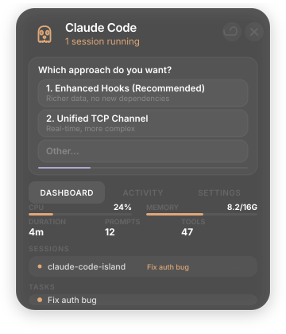

# Claude Code Island

A Dynamic Island-style floating widget for Windows that monitors Claude Code sessions in real-time. Answer questions directly from the widget without switching to the terminal.

<p align="center">
  
</p>

<p align="center">
  
</p>

## Features

- Floating pill widget at the top of your screen (always-on-top, transparent)
- Real-time monitoring of Claude Code sessions, tasks, and tool usage
- Pixel art ghost mascot with state-based animations (idle, working, success, error)
- Answer `AskUserQuestion` prompts directly from the Island via TCP socket
- Multi-session support
- System info (CPU/RAM), session list, task tracking
- Native Windows notifications on task completion
- Auto-start with Windows option

## Quick Start

```bash
git clone https://github.com/MaybeLOL/claude-code-island.git
cd claude-code-island
npm install
npm run setup
npm start
```

`npm run setup` installs the required Claude Code hooks and updates your `~/.claude/settings.json` automatically.

## How It Works

The Island monitors `~/.claude/` for session files, task data, and history. A `PreToolUse` hook (`island-status.js`) reports tool activity to the widget in real-time.

For `AskUserQuestion`, a separate hook (`island-ask.js`) connects to a TCP server running inside the Island (port 47523). The hook blocks while the Island shows the question. When you click an option, the answer is sent back over the socket and delivered to Claude as feedback.

If the Island isn't running, questions fall back to the terminal as usual.

## Build

```bash
npm run build
```

Produces a portable `dist/ClaudeCodeIsland.exe` (no installer needed).

## Requirements

- Windows 10/11
- Node.js 18+
- Claude Code CLI installed

## Project Structure

```
main.js          Electron main process (TCP server, file watchers, system info)
index.html       UI (glassmorphism, pixel ghost, question panel)
preload.js       IPC bridge
hooks/
  island-status.js   PreToolUse hook - reports tool activity (5s timeout)
  island-ask.js      PreToolUse hook - TCP client for AskUserQuestion (130s timeout)
setup.js         Installs hooks and configures settings.json
```

## License

MIT
